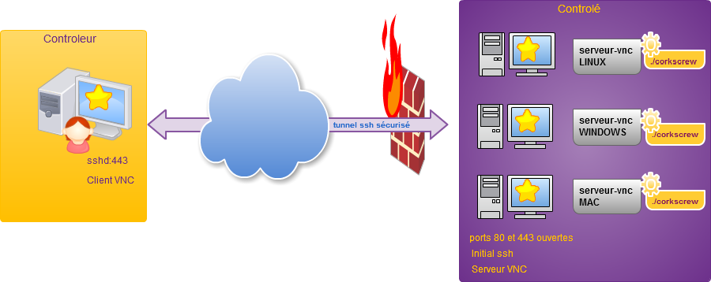
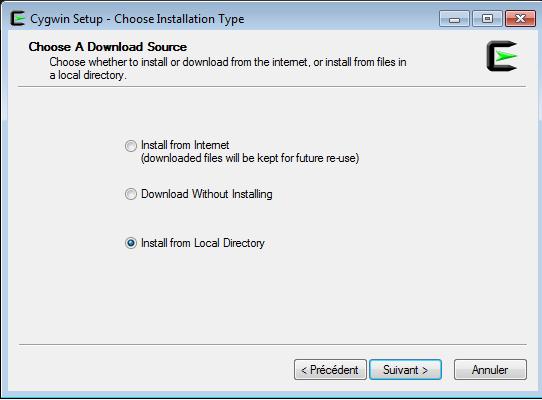
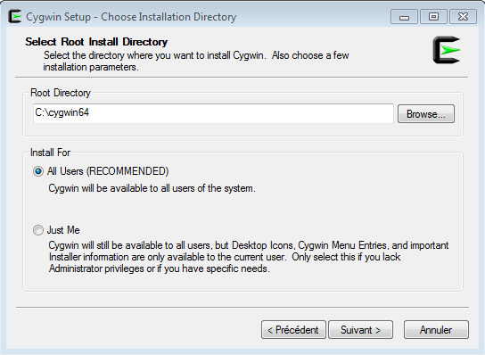
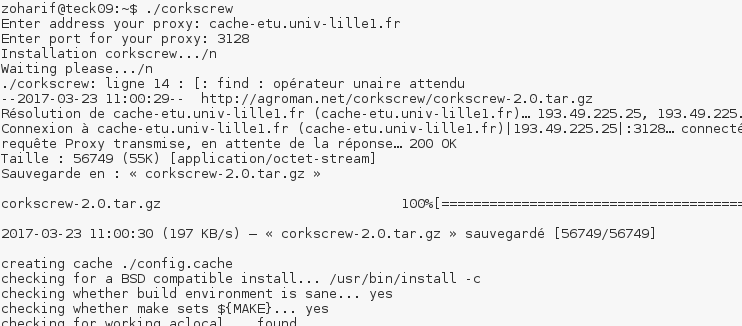
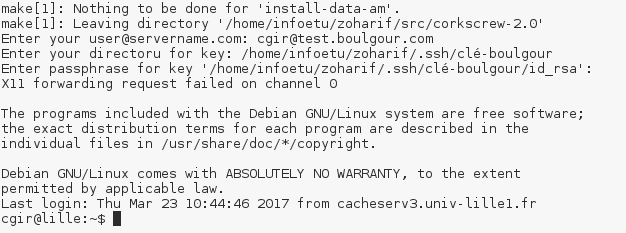
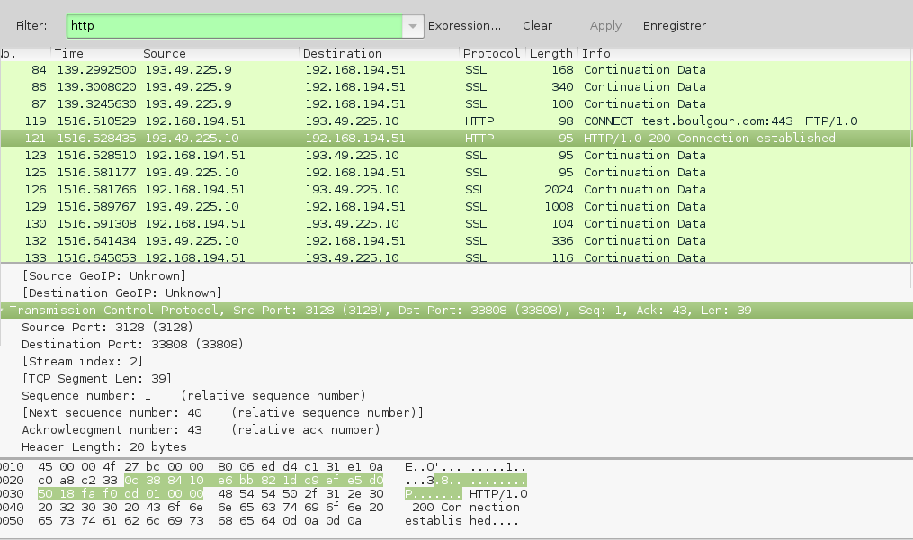

# Présentation

## Objectif du projet

En informatique, l'accès à distance, la commande à distance ou encore le contrôle à distance sont des méthodes qui permettent, depuis un ordinateur éloigné et sans limite théorique de distance, de prendre le contrôle d'un autre ordinateur en affichant l'écran de celui-ci et en manipulant les fonctions correspondant au clavier et à la souris.

Les solutions d'accès à distance vous permettent d'accéder à pratiquement n'importe quel système d'exploitation, n'importe où dans le monde, de le réparer. Les techniciens peuvent discuter avec l'utilisateur, visionner et contrôler ses systèmes et ses appareils et même collaborer avec d'autres techniciens ou intervenants externes pour résoudre rapidement tous les problèmes.

L'objectif principal de ce projet est de mettre en place une procédure permettant de prendre le contrôle (ou de voir) l'écran d'une machine connectée à un réseau privé qui n'a accès à l'Internet que via un proxy web à partir d'une machine avec une adresse publique sur l'Internet.

La machine à assister (celle qui offre son écran et qui est sur le réseau privé) peut fonctionner sous Linux, Windows ou Mac OS X.

La machine d'assistance, qui assiste, (celle qui regarde l'écran et qui est sur le réseau publique) fonctionne sous Linux uniquement.

L'intégralité des outils utilisés doivent être disponible avec une licence libre.

Les données circulant entre les deux machines doivent être chiffrées.

La procédure à mettre en place sur la machine à assister doit être la plus simple possible (accessible à un *non-informaticien*) et si possible automatisable (via un programme/script).



## Etude des solutions

Pour l'étude des solutions et du projet, nous l'avons découpé en différente partie.

* 1ère partie : Trouver un outils permettant de traverser le proxy avec SSH.

### Reverse ssh

Le principe consiste à initier une connexion depuis la machine derrière le proxy sur une machine tierce, et ainsi permettre une connexion retour depuis la machine tierce qui ne sera pas bloquée. Cette façon de procéder est très utile pour dépanner quelqu'un à distance qui aura juste à initier la connexion sortante en tapant une ligne depuis le terminal, sans avoir à configurer le pare-feu/routeur/BOX. Il n'est également pas nécessaire de connaitre l'adresse IP de la machine distante ni d'effectuer un routage de la connexion.

> Le principe de connexion à SSH est habituellement basé sur le système du Client local qui se connecte au Serveur distant. mais ici c'est le Serveur distant qui se connecte au Client local.

### ngrok

Pendant nos recherches,nous avons découvert `ngrok`. Après avoir étudié `ngrok`, nous avons compris
 que ce n'était pas adapté à notre projet. Néanmois, il reste très intéressant.
`Ngrok` est un logiciel couplé à un service web qui permet de créer un tunnel à partir d'internet vers
 un port de notre choix sur la machine local.
Il permet par exemple de partager un site web en cours de développement sur la machine local
avec n'importe qui à travers le monde.
L'application va créer un tunnel et va fournir un adresse du type **xxxx.ngrok.com**.
Il faut juste communiquer cette adresse aux personnes que l'on souhaite partager
et l'ouvrir depuis son navigateur. Lorsque la requête web arrive sur le serveur de **ngrok**,
ce dernier redirige le sous-domaine **xxxx** vers votre machine. C'est ce qu'on appelle
 un **reverse proxy**
Pour plus de rensignement, je vous invite à consulter le site web https://ngrok.com/.

### Corkscrew

Il est possible de faire passer une connexion SSH à travers un proxy web du moment que
celui-ci autorise la méthode CONNECT. Cette méthode est utilisée lors des connexions HTTPs
par exemple et permet d'établir un tunnel HTTP.
Il est assez courant qu'un proxy (ou serveur mandataire) laisse passer ce genre de communication.
C'est la solution que nous avons retenue.
Pour nous faciliter cette tâche, il existe un utilitaire qui s'occupe d'établir
une fausse connexion HTTP entre votre machine et la machine distante.
Car un proxy n'est juste qu'un relai, entre une machine sur le réseau local qui demande
une requête HTTP, et le serveur distant. Ce logiciel demande donc à notre proxy web
s'il peut se connecter à la machine distante pour communiquer avec elle.
Le serveur proxy s'exécute en pensant qu'il va s'agir d'une communication HTTPs,
notre logiciel communique donc maintenant avec la machine distante et passe maintenant
le relai à la commande ssh. Cet utilitaire s'appelle ```corkscrew```.

* 2ème partie : L'étude de VNC

### Deux types de serveur VNC

* Le premier consiste à prendre le contrôle du poste distant, donc à contrôler sa session
ainsi que sa souris et son clavier.

* Le deuxième type de serveur VNC créer une session *virtuelle* accessible par le client.
Le client exploite donc les ressources du serveur pour utiliser cette session virtuelle.
Il ne pourra donc pas intéragir à la place du clavier et de la souris du serveur.

#### Serveur libre :

* X11vnc : Chiffrement SSL, identifiant et mot de passe. Il permet les transferts de fichier
au formats UltraVNC et TightVNC. Celui-ci fonctionne sur les systèmes d'exploitation Windows et Unix.
* TightVNC serveur : chiffrement optimisé pour les connexions à faible débit.
Ce service fonctionne sur Windows.
* Vino : pour environnement GNOME.
* UltraVNC : Permet l'utilisation d'un plugin open-source de chiffrement.
Il permet également une identification basée sur les comptes utilisateurs NTLM et Active Directory.
Il fonctionne sur les systèmes d'exploitation Windows et Unix.

### Client libre

* GNU/Linux
    * tightvnc-java
    * vnc-java
    * tightvncviewer
    * vnc4viewer
* Windows
    * UltraVNC
* OS X
    * Nous pouvons utiliser l'application de partage d'écran intégrée ou accéder à cette application via Safari. Dans Safari, nous pouvons saisir `vnc://yourserverip:5901`

Par défaut VNC utilise le port 5900 pour les connexions classiques du client VNC Viewer et le port 5800 pour le client VNC HTTP Java.

* ### SSH depuis la machine Windows:
Pour faire SSH depuis une machine windows nous avons eu deux choix, Putty ou Cygwin.
* Putty:
PuTTY est un émulateur de terminal doublé d'un client pour les protocoles SSH, Telnet, rlogin
et TCP brut.


* Cygwin:
Cygwin est une collection de logiciels libres à l'origine développés par Cygnus Solutions
permettant à différentes versions de Windows de Microsoft d'émuler un système Unix.

## Avantages des solutions retenues

Pour effectuer le tunnel à travers le proxy, nous avons choisi Corkscrew.
L'avantage principal est que la machine distante n'a pas de configuration spécifique à faire.
Le seul problème que l'on peut rencontrer concerne le proxy web. Si il n 'est pasforcément
autorisé à joindre le port 22 (ssh) sur une machine distante mais cela reste assez rare que des
machines s'échangent des données en HTTP avec ce port.
Dans ce cas, il suffit soit de faire une redirection de port sur la
machine distante ```(ip proxy => port 443 => port 22/ssh)```,
soit de lancer le démon ssh en écoute sur un autre port. Il suffira de choisir le port ```443```
qui correspond habituellement au HTTPs pour être tranquille avec ce genre de filtrage.

Pour la seconde partie, nous avons choisi xtightvncviewer(client) et X11vnc(serveur) pour Linux
et TightVNC(serveur) pour Windows. Ce sont tous des logiciels libres.
Pour le bon fonctionnement de notre projet, nous avons décidé de mettre en place VNC en mode `reverse`.

Pour utiliser SSH depuis notre machine Windows, nous avons décidé d'installer Cygwin. Ce logiciel
permet d'émuluer un environnement UNIX sur une machine Windows.

# Mise en oeuvre

Pour mener à bien ce projet, nous avons découpé les tâches afin d'arriver au résultat final.
Nous avons tout d'abord pris connaissance le fonctionnement de corkscrew, puis le fonctionnement de VNC.
Nous avons ensuite couplé les deux protocoles. Et la dernière étape consistait à passer le proxy via `corkscrew` au travers de SSH.


## SSH au dessus du proxy HTTP/HTTPS


## Creuser un tunnel sous HTTP avec Corkscrew

### Linux --> Linux

Corkscrew est un simple outil pour faire un tunnel TCP à travers un proxy HTTP. Il peut être utilisé par exemple pour se connecter à un serveur SSH, qui écoute sur le port 443, à travers un proxy HTTPS dit « strict ».

#### Installation de Corkscrew

Corkscrew va s’installer sur notre machine cliente.Il'y a deux maniére pour installer corkscrew:

1. Si nous sommes sur Debian c’est toujours la même mélodie :

```
shirin@debian:~$ sudo apt-get install corkscrew
```

2. Pour le construire

  * nous devons le télécharer et décompresser:

```
wget http://agroman.net/corkscrew/corkscrew-2.0.tar.gz
tar xf corkscrew-2.0.tar.gz
```

  * puis, dans le répertoire de corkscrew, tapez ```./configure```
  * puis ```make```
  * Pour l'installer dans le répertoire du corkscrew, tapez ```make install```

Vous devriez trouver corkscrew dans votre gestionnaire de paquets habituels peu importe votre distribution, il existe même sur Mac port c’est vous dire.

#### Comment est-il utilisé?

La mise en place de corkscrew avec SSH / OpenSSH est très simple. Ajouter La ligne suivante vers votre fichier ~ / .ssh / config :

```
Host *
   ProxyCommand /tmp/toto/bin/corkscrew cache-etu.univ-lille1.fr 3128 %h %p
```

> il faut remplacer ```/tmp/toto/bin/corkscrew``` ```cache-etu.univ-lille1.fr``` et ```3128``` par des valeurs correctes.

#### Problème avec la connection au serveur avec ssh:

malgré que la clé ssh soit correcte, je reçoie ce message d'erreur:

```
ssh -vvv XXX@test.boulgour.com
OpenSSH_6.7p1 Debian-5+deb8u3, OpenSSL 1.0.1t  3 May 2016
debug1: Reading configuration data /home/infoetu/XXX/.ssh/config
debug1: /home/infoetu/XXX/.ssh/config line 5: Applying options for *
debug1: Reading configuration data /etc/ssh/ssh_config
debug1: /etc/ssh/ssh_config line 19: Applying options for *
debug1: Executing proxy command: exec /tmp/toto/bin/corkscrew cache-etu.univ-lille1.fr 3128 test.boulgour.com 22
debug1: permanently_drop_suid: 1779
debug1: identity file /home/infoetu/XXX/.ssh/id_rsa type 1
debug1: key_load_public: No such file or directory
debug1: identity file /home/infoetu/XXX/.ssh/id_rsa-cert type -1
debug1: key_load_public: No such file or directory
debug1: identity file /home/infoetu/XXX/.ssh/id_dsa type -1
debug1: key_load_public: No such file or directory
debug1: identity file /home/infoetu/XXX/.ssh/id_dsa-cert type -1
debug1: key_load_public: No such file or directory
debug1: identity file /home/infoetu/XXX/.ssh/id_ecdsa type -1
debug1: key_load_public: No such file or directory
debug1: identity file /home/infoetu/XXX/.ssh/id_ecdsa-cert type -1
debug1: key_load_public: No such file or directory
debug1: identity file /home/infoetu/XXX/.ssh/id_ed25519 type -1
debug1: key_load_public: No such file or directory
debug1: identity file /home/infoetu/XXX/.ssh/id_ed25519-cert type -1
debug1: Enabling compatibility mode for protocol 2.0
debug1: Local version string SSH-2.0-OpenSSH_6.7p1 Debian-5+deb8u3
Proxy could not open connnection to test.boulgour.com:  Forbidden
ssh_exchange_identification: Connection closed by remote host
```

je trouve que corkscrew peut être utilisé pour se connecter à un serveur SSH exécuté sur un port 443 distant via un proxy HTTPS strict.donc je pense le seul moyen pour resoudre ce problem est de changer le port ssh sur serveur distance, en ajoutant lien suivant au fichier sshd_config : `Port 443`

```
ssh -vvv -X -p 443  -i ~/.ssh/keys/id_rsa XXX@test.boulgour.com

X: Active la transmission X11.
v: verbose mode,Cause que ssh imprime des messages de débogage sur sa progression. Cela est utile pour déboguer les problèmes de connexion, d'authentification et de configuration. Multiple -v Options augmentent la verbosité. Le maximum est 3.
i: Sélectionne un fichier à partir duquel l'identité (clé privée) pour l'authentification par clé publique est lue.
p: Port à connecter à l'hôte distant.

```

Et voila on est connecté:

```
Enter passphrase for key '/root/.ssh/keys/id_rsa':

The programs included with the Debian GNU/Linux system are free software;
the exact distribution terms for each program are described in the
individual files in /usr/share/doc/*/copyright.

Debian GNU/Linux comes with ABSOLUTELY NO WARRANTY, to the extent
permitted by applicable law.
Last login: Wed Mar  8 15:42:21 2017 from cacheserv2.univ-lille1.fr
XXX@lille:~$
```

### Windows --> Linux
Pour creuser un tunnel sous HTTP avec Corkscrew sur une machine Windows j'installe Cygwin.
#### Cygwin:
Cygwin est un ensemble de programmes permettant d’émuler, dans une certaine mesure,
un environnement linux sous windows. Il ne nécessite aucun partitionnement ou modifi-
cation du système windows, c’est une couche supplémentaire qui tourne par dessus. Les
performances sont donc moins bonnes, et toutes les fonctionnalités d’un système Unix
ne sont pas reproduites.
Il s’agit néanmoins d’un choix très judicieux si on souhaite disposer d’un environnement
linux de base sans modification lourde de son PC windows, et sans se connecter à distance
en permanence. Il faut cependant disposer d’une connexion internet haut débit
pour télécharger les fichiers assez volumineux qui composent ces programmes.

#### Installation Cygwin:
Allez sur la page web d’accueil de Cygwin :
www.cygwin.com
Pour une première installation, suivre le lien Install ou pour une mise à jour ou des
compléments, suivre le lien Update. Ils aboutissent tous les deux à la page :
www.cygwin.com/install.html
Avant de continuer, il faut savoir si on dispose d’un système Windows 32 bits ou 64
bits : selon le cas, on doit télécharger le fichier setup-x86.exe ou setup-x86_64.exe
(cas des systèmes les plus récents). On récupère ainsi un fichier exécutable windows qui
permettra d’installer les différents composants de Cygwin, que ce soit pour la première
installation ou, ultérieurement, pour l’ajout de composants. Une fois téléchargé, exécuter
ce fichier.
Trois possibilités sont offertes :



a priori Install from Internet est celle qu’il vous faut.
Ce choix demande à Cygwin de télécharger puis d’installer les fichiers que vous demanderez.
À l’écran suivant, le "Root Directory" est le point de votre disque dur qui sera, plus tard,
la racine (/) de votre système de fichiers cygwin.



Le choix par défaut,est `C:\cygwin`, recommandé. Il est conseillé de laisser les autres options telles que recommandées, sauf si on sait ce qu’on fait...

L’écran suivant demande le "Local Package Directory", c’est là qu’il stocke les fichiers compressés des composants qui seront installés. Par défaut c’est le répertoire où a été
téléchargé setup-x86_64.exe, aussi modifiez le tel que vous le souhaitez, par exemple ```C:\cygwin_packages```


Une liste de composants s’affiche, classée par thème. Développez l’arborescence pour connaître le contenu des thèmes. Seront installés ceux qui ont un numéro de version,tandis que les autres sont ignorés ("skip"), j'ai choisi les choix par défaut.

Une fois le choix fait, appuyez sur "suivant". Les éventuelles «dépendances» supplémentaires sont signalées, acceptez leur installation et continuez.
Une fois l’installation effectuée vous disposez d’un terminal texte sous bash, comparable à celui que vous ouvrez sur les stations linux.

Puis dans terminale:

```
export http_proxy="http://cache-etu.univ-lille1.fr:3128"

export HTTPS_PROXY="http://cache-etu.univ-lille1.fr:3128"
```
Et puis comme l'environement Linux-bash:

```
wget http://www.agroman.net/corkscrew/corkscrew-2.0.tar.gz
```
Et j'ai reçue l'erreur:

```
bash make: command not found
```
Pour résoudre ce problème j'ai suivi les étapes suivantes:
* Revenir à l'installateur.(cygwin.exe)
* Effectuer la configuration initiale.
* Sous bibliothèque - aller à devel.
* Sous devel scroll et trouver les packets suivants:

>>  * Openssh
>>  * Bash
>>  * Binutils
>>  * make
>>  * wget

* Cliquer sur Suivant, prendra un certain temps pour l'installer.

Cela résoudra le problème.
J'ai relancé la commande:
```
wget http://www.agroman.net/corkscrew/corkscrew-2.0.tar.gz
```
Et puis comme l'environement linux-shell:
```
tar xfz corkscrew-2.0.tar.gz
cd corkscrew-2.0
./configure
make
make install
```
Pour plus d'infos sur installation corkscrew voire lien suivant:
https://github.com/b3/hacks-vncproxy/blob/master/doc/install-config-corkscrew.md

Et voilà installation corkscrew sur Windows est finie.

Maintenet je dois copier ma clé publique dans répertoire .ssh:
```
cp /cygdrive/e/usb/key-ssh/id_rsa* ~/.ssh
```

J'avais ma clé sur ma clé-USB et donc je le copiais tous simplement.

Puis j'ai fait la command suivant:
```
ssh -i ~/.ssh/id_rsa -p 443 -o "ProxyCommand /tmp/corkscrew-2.0/corkscrew.exe cache.univ-lille1.fr 3128 %h %p" XXX@test.boulgour.com
Enter passphrase for key '/home/Utilisateur/.ssh/id_rsa':
```
Et voila ça marche trés bien. :D


### Script d'automatisation
Pour automatiser les taches j'ai écrit un petit script qui va installer corkscrew et il stabilisait une connexion ssh:

```
#!/bin/bash
read -p "Enter address your proxy: " proxy
read -p "Enter port for your proxy: " port
if [ -x $HOME/src/corkscrew-2.0 ]; then
	echo "It's cool, Corkscrew is install in your machine!!!"
else
	echo "Installation corkscrew...\n"
	echo "Waiting please...\n"
	set -e
	mkdir $HOME/src
	cd $HOME/src
	export http_proxy=http://$proxy:$port
	wget http://agroman.net/corkscrew/corkscrew-2.0.tar.gz
	tar xf corkscrew-2.0.tar.gz
	cd corkscrew-2.0
	./configure --prefix=$HOME
	make
	make install
	cd .. && rm -rf corkscrew-2.0 corkscrew-2.0.tar.gz
fi

read -p "Enter your user@servername.com: " server
read -p "Enter your directoru for key: " key
ssh -XC -i $key/id_rsa  -p 443 $server -o "ProxyCommand $HOME/src/corkscrew $proxy $port %h %p"

```
Ce script vérifie que Corkscrew est installé ou non, si oui il va initier une connexion SSH,
sinon Corkscrew n'est pas installé, il va l'installer et puis effectuerla connexion SSH.







## Connection VNC sur machine Linux

### Virtual Network Computing (VNC)


Virtual Network Computing (VNC) est un logiciel utilisé pour se connecter à un ordinateur distant.
Il permet de transmettre les saisies au clavier ainsi que les clics de la souris d'un ordinateur à l'autre.
Cela permet tout simplement de prendre le contrôle d'une machine distante qu'elle soit en local ou par le biais d'internet.
Pour l'utiliser, nous avons besoin d'un `client VNC` ainsi qu'un `serveur VNC`.
Le client VNC se connecte sur un serveur et permet d'en prendre son contrôle.


Dans le cadre de notre projet, nous avons besoin d'utiliser VNC en mode `reverse`
Ce n'est pas le client qui se connecte au serveur mais l'inverse. Le client va attendre qu'un serveur vienne se connecter à lui.
Nous avons donc mis en place ce `reverse VNC` entre deux machines situées sur le même réseau local (sans traverser de proxy)
>>### Reverse VNC
Nous allons donc prendre le contrôle d'une machine Linux à l'aide d'une autre machine Linux située sur le même réseau privé (Salle de TP).
L'adresse ip de la machine qui prend le contrôle est : `172.18.48.231`
Le port d'écoute est le `5500`

Pour le client, il faut télécharger le paquet `xtightvncviewer`
Ensuite, il faut éxécuter la commande :
```
 `xvncviewer -listen`
```


Cette commande permet au client d'écouter sur le port `5500` et attend qu'un serveur vienne écouter sur ce même port afin d'établir la connection.
Maintenant, il faut lancer le serveur sur l'autre machine.  *
Pour le serveur, il faut installer le paquer `x11vnc`.
Ensuite il faut lancer la commande suivante :
```
$ x11vnc -connect [@ip_machine_contrôle]:[port_écoute]
```
Dans notre exemple :
```
$ x11vnc -connect 172.18.48.231:5500
```
Le client a pris possession de la machine serveur.
Le `reverse VNC` fonctionne entre deux machines `linux`, Il faut maintenant obtenir le même résultat entre une machine Windows et Linux.

## Connection VNC sur machine Windows

Le but maintenant, c'est de trouver un serveur VNC (libre) sous Windows. Nous avons choisi le serveur `TightVNC`. C'est un logiciel libre et il dispose d'une bonne communauté en cas de besoin.

### Reverse VNC
Comme sur les machines Linux, il faut utiliser VNC en mode `reverse`.
Sur la machine cliente (Linux), il faut taper la même commande vue précédemment :
```
$ xvncviewer -listen
```
Le client va écouter sur le port `5500` et attendre qu'un serveur lui diffuse son écran.


Sur le serveur (machine Windows), il faut installer `Tight VNC`
Une fois `TightVNC` installé et le client lancé, il faut démarrer `TightVNC Server(service mode)`. Pour le fonctionnement en reverse, il faut faire un clic droit sur l'icône en bas à droite dans la barre  de tâches et de cliquer sur `attach listening viewer`


Une boîte de dialogue apparaît dans laquelle il faut entrer l'adresse de la machine avec laquelle on veut partager la connexion
ainsi que le port d'écoute. Cliquer sur `attach` pour valider.


Le `reverse vnc` fonctionne à présent sur Linux et Windows.
L'étape suivante consiste à éxécuter le `reverse VNC` au travers de ssh.

## VNC au dessus de SSH sans proxy

SSH est un protocole de communication permettant d'effectuer des opérations sécurisées sur un réseau non-sécurisé. Par extension c'est également un programme qui implémente ce protocole.

Historiquement il est, *notamment*, construit pour exécuter des commandes via un shell sur une machine distante à partir d'une machine locale. C'est de la que vient son nom **S**ecure **SH**ell.

Il permet d'établir une connexion sécurisée et chiffrée entre les deux machines puis exécute un shell sur la machine distante dans lequel les commandes demandées sont exécutées. L'utilisateur de la machine locale doit pouvoir s'identifier sur la machine distante en tant qu'un utilisateur existant sur celle-ci.

Plusieurs méthodes d'authentification sont possibles.

* la fourniture/vérification du mot de passe de l'utilisateur distant par l'utilisateur local
* une *poignée de main* chiffrée via la mise à disposition de l'utilisateur distant par l'utilisateur local d'une clé publique

Sous Unix, pour utiliser SSH, il faut tout simplement installer le paquet `openssh` pour la partie cliente et `openssh-server` pour la partie serveur.

Sous Debian GNU/Linux cela revient à exécuter une des deux commandes suivantes en tant qu'administrateur (`root`) :

    apt-get update && apt-get install openssh
    apt-get update && apt-get install openssh-server

Sous Debian GNU/Linux, la configuration de SSH se fait via différents fichiers :

* `/etc/ssh/ssh_config` : configuration par défaut du client ssh
* `/etc/ssh/sshd_config` : configuration du serveur ssh
* `/etc/ssh_host_rsa_key` : clé privée du serveur
* `/etc/ssh/ssh_host_rsa_key.pub` : clé publique du serveur

Parmi les lignes importantes du fichier de configuration du serveur on peut noter :

* `Port 22` signifie que le serveur SSH écoute sur le port 22 (Port par défaut de SSH). Pour écouter sur un autre port, il suffit donc de changer cette ligne.
* `PermitRootLogin yes` signifie qu'une connection en tant que `root` est possible par SSH quelque soit l'authentification utilisée. D'autres valeurs sont possibles :
    * `no` : dans ce cas `root` aucune connection en tant que `root` ne sera possible sur le serveur. Il faudra alors se connecter en tant que simple utilisateur puis utiliser la commande `su` pour devenir `root`.
    * `without-password` : dans ce cas une connection en tant que `root` sur le serveur n'est possible que si l'authentification utilisée n'est pas la fourniture du mot de passe (mais uniquement l'échange de clés). C'est la valeur par défaut sur une installation Debian GNU/Linux depuis la version `jessie`.

Par défaut le serveur SSH écoute sur le port 22. Si on veut pouvoir le faire écouter **en plus** sur un autre port une solution est de demander à un firewall de faire ce travail de redirection de ports.

Sur Debian GNU/Linux on peut par exemple installer puis utiliser la commande `iptables` qui permet la manipulation des tables réseaux du noyau.

Pour l'installer il suffit d'exécuter la commande suivante

    apt-get iptables

Pour ajouter des règles permettant de diriger les connexions sur le port 443 vers le port 22 de la machine courante (on suppose ici que son IP est 192.168.0.42) sur lequel le serveur SSH est en écoute, il suffit d'exécuter les commandes suivantes

    iptables -t nat -I PREROUTING --src 0/0 --dst 192.168.0.42 -p tcp --dport 443 -j REDIRECT --to-ports 22
    iptables -t nat -I OUTPUT --src 0/0 --dst 192.168.0?42 -p tcp --dport 443 -j REDIRECT --to-ports 22

Pour se connecter à une machine, on exécute la commande :

    ssh [nom_utilisateur]@machine

SSh utilise une méthode chiffrement asymétrique. A la différence du chiffrement symétrique, le chiffrement asymétrique utilise une clé pour chiffrer et une autre clé pour déchiffrer.

Il y a donc deux clés :

* une clé **publique** servant à chiffrer
* une clé **privée** servant à déchiffer

Chaque utilisateur peut générer sa paire de clé a l'aide de la commande : `ssh-keygen`

Cette commande va générer une paire de clé qui sera stockée dans le répertoire : `~/.ssh`.

Par défaut, le fichier `id_rsa` contient la clé privée et le fichier `id_rsa.pub` contient la clé publique.

Une fois les clés générées, pour utiliser une authentification par poignée de main, il faut copier la clef publique dans le fichier `~/.ssh/authorized_keys` de l'utilisateur de la machine sur laquelle on veut se connecter à distance.

Cette commande permet de réaliser cette opération :

    ssh-copy-id -i ~/.ssh/id_rsa.pub login@nom_machine_serveur

L'utilisateur de la machine distante (le serveur SSH) possède maintenant la clé publique de l'utilisateur de la machine local (le client SSH). Les deux machines peuvent maintenant s'échanger des données chiffrées et les déchiffrer avec une authentification sécurisée sans échange de mot de passe sur le réseau.

>>>### VNC et SSH sur machine Linux-Linux(sans proxy)

Maintenant, nous pouvons établir une connexion VNC au travers de SSH.


La conexion SSH se fera dans un premier temps sur le même réseau local.
Il y a 3 étapes pour établir la connexion vnc au travers de vnc.
**1ère étape:**

La connexion ssh doit se faire à partir du controlé avec cette commande :
```
$ ssh -R 5500:[@ip_contrôleur]:[5500] localhost
```
`-R`: permet de spécifier que tout ce qui arrive sur le port 5500 de la machine distante (controleur) sera transféré sur la machine local (controlé) via le port 5500


**2ème étape :**

Sur la machine distante (controleur), il faut lancer le client vnc. Il sera alors en écoute sur le port 5500 et attend qu'un serveur vienne écouter sur ce même port.

	$ xvnc4viewer -listen

Les manipulations sont terminées coté controleur.

**3ème étape :**

Il faut maintenant lancé le server vnc coté `controlé`.

	$ x11vnc -connect localhost:5500

Cette commande permet de se connecter à localhost via le port 5500.

Sur l'écran du controleur, on a bien pris la main du controlé.

>>>### VNC et SSH sur machine Linux-Windows(sans proxy)

Il faut maintenant établir une connexion VNC au travers de SSH entre machine Windows -Linux.

Sur le controlé (machine Windows), nous avons installé `Cygwin`. Ce logiciel va permettre de lancer
la connexion SSH.

Comme vue précédemment, il y a 3 étapes pour établir la connexion.

**1ère étape**

La connexion ssh doit se faire à partir du contrôlé (machine Windows)

Depuis `Cygwin`, lancer la commande suivante:
```
$ ssh -R 5500:[@ip_contrôleur]:5500 localhost
```

**2ème étape**

Sur le contrôleur, il faut lancer le client VNC :
```
$ xvnc4viewer -listen
```

**3ème étape**

Il faut lancer le serveur VNC sur le contrôlé (Windows).

Il suffit d'effectuer les mêmes étapes situé dans la section **Connection VNC sur machine Windows**
Et c'est terminé !

### VNC et SSH à traverse de proxy

Pour finaliser notre projet nous avons faire les étapes suivants:

```
Serveur (controlé) Linux:
 1. Executer le script ```./corkscrew ```

Client (controleur) Linux:
 2. Lancer le client vnc ```$ xvnc4viewer -listen```

Serveur (controlé) linux:
 3. Lancé le server vnc ```$ x11vnc -connect localhost:5500```
```


```
Serveur (controlé) Windows:
 1. Executer le script dans Cygwin```./corkscrew ```

Client (controleur) Linux:
 2. Lancer le client vnc ```$ xvnc4viewer -listen```

Serveur (controlé) Windows:
 3. Clic droit sur l'icône en bas à droite dans la barre de tâches et de cliquer sur attach listening viewer

 4. Entrer l'adresse de la machine avec laquelle on veut partager la connexion ainsi que le port d'écoute
```

# Conclusion

Ce projet nous a permis de découvrir à maîtriser des outils aux administrateurs systèmes comme VNC,
corkscrew, cygwin... Nous avons pu répondre à la problématique qui était de pouvoir prendre le contrôle
d'un pc à distance situé derrière un proxy. Nous seront sûrement amenés à faire ce genre de manipulation
dans notre futur métier d'administrateur systèmes et réseaux.
Ce projet nous a également permis de travailler en équipe tout en se partageant les tâches. Nous avons
aussi appris à manipuler l'outils GIT. Celui-ci nous a permis de mettre en commun nos travaux et de voir
l'avancement du projet.


Nous tenons à remercier M.Beaufils pour son encadrement, ainsi que les administrateur de l'IUT pour le prêt de la machine Windows et leurs conseils.

# Annexes





