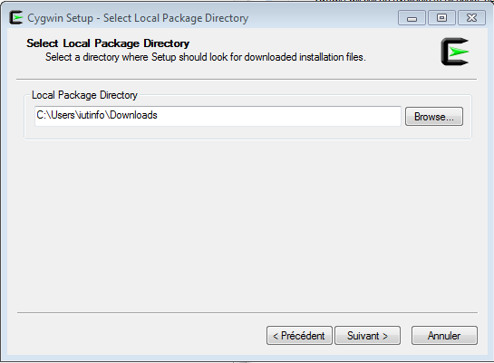

# Install cygwin

To install the Cygwin net release, go to https://cygwin.com/ and run either setup-x86.exe to install the 32 bit version of Cygwin, or setup-x86_64.exe to install the 64 bit version of Cygwin. This will download a GUI installer which can be run to download a complete cygwin installation via the internet. Follow the instructions on each screen to install Cygwin.

On Windows Vista and later, setup.exe will check by default if it runs with administrative privileges and, if not, will try to elevate the process. If you want to avoid this behaviour and install under an unprivileged account just for your own usage, run setup.exe with the --no-admin option. 

Since the default value for each option is the logical choice for most installations, you can get a working minimal Cygwin environment installed by simply clicking the Next button at each page. The only exception to this is choosing a Cygwin mirror, which you can choose by experimenting with those listed at https://cygwin.com/mirrors.html

#### Download Source

 > Cygwin uses packages to manage installing various software. When the default Install from Internet option is chosen, setup.exe creates a local directory to store the packages before actually installing the contents. Download from Internet performs only the first part (storing the packages locally), while Install from Local Directory performs only the second (installing the contents of the packages).

> The Download from Internet option is mainly for creating a base Cygwin package tree on one computer for installation on several machines with Install from Local Directory; copy the entire local package tree to another machine with the directory tree intact. For example, you might create a C:\cache\ directory and place setup.exe in it. Run setup.exe to Install from Internet or Download from Internet, then copy the whole C:\cache\ to each machine and instead choose Install from Local Directory.

#### Selecting an Install Directory

The Root Directory for Cygwin (default C:\cygwin) will become / within your Cygwin installation. You must have write access to the parent directory, and any ACLs on the parent directory will determine access to installed files.

The Install For options of All Users or Just Me should always be left on the default All Users, unless you do not have write access to HKEY_LOCAL_MACHINE in the registry or the All Users Start Menu. This is true even if you are the only user planning to use Cygwin on the machine. Selecting Just Me will cause problems for programs such as crond and sshd. If you do not have the necessary permissions, but still want to use these programs, consult the Cygwin mailing list archives about others' experiences. 

#### Local Package Directory

The Local Package Directory is the cache where setup.exe stores the packages before they are installed. The cache must not be the same folder as the Cygwin root. Within the cache, a separate directory is created for each Cygwin mirror, which allows setup.exe to use multiple mirrors and custom packages. After installing Cygwin, the cache is no longer necessary, but you may want to retain the packages as backups, for installing Cygwin to another system, or in case you need to reinstall a package. 

#### Connection Method

The Direct Connection method of downloading will directly download the packages, while the IE5 method will leverage your IE5 cache for performance. If your organisation uses a proxy server or auto-configuration scripts, the IE5 method also uses these settings. If you have a proxy server, you can manually type it into the Use Proxy section. Unfortunately, setup.exe does not currently support password authorization for proxy servers. 

#### Choosing Mirrors

Since there is no way of knowing from where you will be downloading Cygwin, you need to choose at least one mirror site. Cygwin mirrors are geographically distributed around the world; check the list at https://cygwin.com/mirrors.html to find one near you. You can select multiple mirrors by holding down CTRL and clicking on each one. If you have the URL of an unlisted mirror (for example, if your organization has an internal Cygwin mirror) you can add it. 

