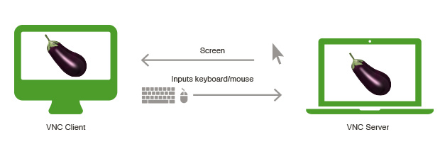
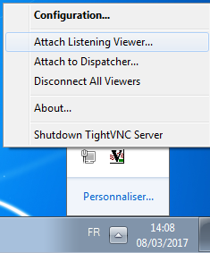

# Présentation
>## Objectif du projet

L'objectif principal est de mettre en place une procédure permettant de prendre le contrôle (ou de voir) l'écran d'une machine connectée à un réseau privé qui n'a accès à l'Internet que via un proxy web à partir d'une machine avec une adresse publique sur l'Internet.

La machine à assister (celle qui offre son écran et qui est sur le réseau privé) peut fonctionner sous Linux, Windows ou Mac OS X.

La machine d'assistance, qui assiste, (celle qui regarde l'écran et qui est sur le réseau publique) fonctionne sous Linux uniquement.

L'intégralité des outils utilisés doivent être disponible avec une licence libre.

Les données circulant entre les deux machines doivent être chiffrées.

La procédure à mettre en place sur la machine à assister doit être la plus simple possible (accessible à un *non-informaticien*) et si possible automatisable (via un programme/script).


>## Etude des solutions
>## Avantages des solutions retenues  
# Mise en oeuvre

Pour mener à bien ce projet, nous avons découpé les tâches afin d'arriver au résultat final.
Nous avons tout d'abord pris connaissance du fonctionnement de VNC, puis le fonctionnement de SSH.
Nous avons ensuite couplé les deux protocoles. Et la dernière étape consistait à passer le proxy via `corkscrew`.

>## Connection VNC sur machine Linux
>>### Virtual Network Computing (VNC)
Virtual Network Computing (VNC) est un logiciel utilisé pour se connecter à un ordinateur distant.
Il permet de transmettre les saisies au clavier ainsi que les clics de la souris d'un ordinateur à l'autre.  
Cela permet tout simplement de prendre le contrôle d'une machine distante qu'elle soit en local ou par le biais d'internet.  
Pour l'utiliser, nous avons besoin d'un `client VNC` ainsi qu'un `serveur VNC`.
Le client VNC se connecte sur un serveur et permet d'en prendre son contrôle.



Dans le cadre de notre projet, nous avons besoin d'utiliser VNC au mode `reverse`
Ce n'est pas le client qui se connecte au serveur mais l'inverse. Le client va attendre qu'un serveur vienne se connecter à lui.
Nous avons donc mis en place ce `reverse VNC` entre deux machines situées sur le même réseau local (sans traverser de proxy)  
>>### Reverse VNC
Nous allons donc prendre le contrôle d'une machine Linux à l'aide d'une autre machine Linux située sur le même réseau privé (Salle de TP).  
L'adresse ip de la machine qui prend le contrôle est : `172.18.48.231`  
Le port d'écoute est le `5500`  

Pour le client, il faut télécharger le paquet `xtightvncviewer`  
Ensuite, il faut éxécuter la commande :  
```
 `xvncviewer -listen`
```
  

Cette commande permet au client d'écouter sur le port `5500` et attend qu'un serveur vienne écouter sur ce même port afin d'établir la connection.  
Maintenant, il faut lancer le serveur sur l'autre machine.  *
Pour le serveur, il faut installer le paquer `x11vnc`.  
Ensuite il faut lancer la commande suivante :
```  
$ x11vnc -connect [@ip_machine_contrôle]:[port_écoute]
```  
Dans notre exemple :
```  
$ x11vnc -connect 172.18.48.231:5500
```  
Le client a pris possession de la machine serveur.  
Le `reverse VNC` fonctionne entre deux machines `linux`, Il faut maintenant obtenir le même résultat entre une machine Windows et Linux.  
  
>## Connection VNC sur machine Windows

Le but maintenant, c'est de trouver un serveur VNC (libre) sous Windows. Nous avons choisi le serveur `TightVNC`. C'est un logiciel libre et il dispose d'une bonne communauté en cas de besoin.  

>>### Reverse VNC
Comme sur les machines Linux, il faut utiliser VNC en mode `reverse`.
Sur la machine cliente (Linux), il faut taper la même commande vue précédemment :  
```
$ xvncviewer -listen
```
Le client va écouter sur le port `5500` et attendre qu'un serveur lui diffuse son écran.  
   
  

Sur le serveur (machine Windows), il faut installer `Tight VNC`  
Une fois `TightVNC` installé et le client lancé, il faut démarrer `TightVNC Server(service mode)`. Pour le fonctionnement en reverse, il faut faire un clic droit sur l'icône en bas à droite dans la barre  de tâches et de cliquer sur `attach listening viewer`  
  

Une boîte de dialogue apparaît dans laquelle il faut entrer l'adresse de la machine avec laquelle on veut partager la connexion
ainsi que le port d'écoute. Cliquer sur `attach` pour valider.  

  

Le `reverse vnc` fonctionne à présent sur Linux et Windows.  
L'étape suivante consiste à éxécuter le `reverse VNC` au travers de ssh.  

>## VNC au dessus de SSH sans proxy

SSH est un protocole de communication permettant d'effectuer des opérations sécurisées sur un réseau non-sécurisé. Par extension c'est également un programme qui implémente ce protocole.

Historiquement il est, *notamment*, construit pour exécuter des commandes via un shell sur une machine distante à partir d'une machine locale. C'est de la que vient son nom **S**ecure **SH**ell.

Il permet d'établir une connexion sécurisée et chiffrée entre les deux machines puis exécute un shell sur la machine distante dans lequel les commandes demandées sont exécutées. L'utilisateur de la machine locale doit pouvoir s'identifier sur la machine distante en tant qu'un utilisateur existant sur celle-ci.

Plusieurs méthodes d'authentification sont possibles.

* la fourniture/vérification du mot de passe de l'utilisateur distant par l'utilisateur local 
* une *poignée de main* chiffrée via la mise à disposition de l'utilisateur distant par l'utilisateur local d'une clé publique 

Sous Unix, pour utiliser SSH, il faut tout simplement installer le paquet `openssh` pour la partie cliente et `openssh-server` pour la partie serveur. 

Sous Debian GNU/Linux cela revient à exécuter une des deux commandes suivantes en tant qu'administrateur (`root`) :

    apt-get update && apt-get install openssh
    apt-get update && apt-get install openssh-server  

Sous Debian GNU/Linux, la configuration de SSH se fait via différents fichiers :

* `/etc/ssh/ssh_config` : configuration par défaut du client ssh
* `/etc/ssh/sshd_config` : configuration du serveur ssh
* `/etc/ssh_host_rsa_key` : clé privée du serveur
* `/etc/ssh/ssh_host_rsa_key.pub` : clé publique du serveur

Parmi les lignes importantes du fichier de configuration du serveur on peut noter :

* `Port 22` signifie que le serveur SSH écoute sur le port 22 (Port par défaut de SSH). Pour écouter sur un autre port, il suffit donc de changer cette ligne.
* `PermitRootLogin yes` signifie qu'une connection en tant que `root` est possible par SSH quelque soit l'authentification utilisée. D'autres valeurs sont possibles : 
    * `no` : dans ce cas `root` aucune connection en tant que `root` ne sera possible sur le serveur. Il faudra alors se connecter en tant que simple utilisateur puis utiliser la commande `su` pour devenir `root`.
    * `without-password` : dans ce cas une connection en tant que `root` sur le serveur n'est possible que si l'authentification utilisée n'est pas la fourniture du mot de passe (mais uniquement l'échange de clés). C'est la valeur par défaut sur une installation Debian GNU/Linux depuis la version `jessie`.

Par défaut le serveur SSH écoute sur le port 22. Si on veut pouvoir le faire écouter **en plus** sur un autre port une solution est de demander à un firewall de faire ce travail de redirection de ports.

Sur Debian GNU/Linux on peut par exemple installer puis utiliser la commande `iptables` qui permet la manipulation des tables réseaux du noyau.

Pour l'installer il suffit d'exécuter la commande suivante

    apt-get iptables
    
Pour ajouter des règles permettant de diriger les connexions sur le port 443 vers le port 22 de la machine courante (on suppose ici que son IP est 192.168.0.42) sur lequel le serveur SSH est en écoute, il suffit d'exécuter les commandes suivantes 

    iptables -t nat -I PREROUTING --src 0/0 --dst 192.168.0.42 -p tcp --dport 443 -j REDIRECT --to-ports 22
    iptables -t nat -I OUTPUT --src 0/0 --dst 192.168.0?42 -p tcp --dport 443 -j REDIRECT --to-ports 22

Pour se connecter à une machine, on exécute la commande :
    
    ssh [nom_utilisateur]@machine

SSh utilise une méthode chiffrement asymétrique. A la différence du chiffrement symétrique, le chiffrement asymétrique utilise une clé pour chiffrer et une autre clé pour déchiffrer.

Il y a donc deux clés :

* une clé **publique** servant à chiffrer
* une clé **privée** servant à déchiffer

Chaque utilisateur peut générer sa paire de clé a l'aide de la commande : `ssh-keygen`
    
Cette commande va générer une paire de clé qui sera stockée dans le répertoire : `~/.ssh`.

Par défaut, le fichier `id_rsa` contient la clé privée et le fichier `id_rsa.pub` contient la clé publique.

Une fois les clés générées, pour utiliser une authentification par poignée de main, il faut copier la clef publique dans le fichier `~/.ssh/authorized_keys` de l'utilisateur de la machine sur laquelle on veut se connecter à distance.

Cette commande permet de réaliser cette opération :

    ssh-copy-id -i ~/.ssh/id_rsa.pub login@nom_machine_serveur
    
L'utilisateur de la machine distante (le serveur SSH) possède maintenant la clé publique de l'utilisateur de la machine local (le client SSH). Les deux machines peuvent maintenant s'échanger des données chiffrées et les déchiffrer avec une authentification sécurisée sans échange de mot de passe sur le réseau.

>>>### SSH sur machine Linux-Linux

Maintenant, nous pouvons établir une connexion VNC au travers de SSH.  

  

La conexion SSH se fera dans un premier temps sur le même réseau local.  
Il y a 3 étapes pour établir la connexion vnc au travers de vnc.  
**1ère étape:** 

La connexion ssh doit se faire à partir du controlé avec cette commande :
```
$ ssh -R 5500:[@ip_contrôleur]:[5500] localhost
```
`-R`: permet de spécifier que tout ce qui arrive sur le port 5500 de la machine distante (controleur) sera transféré sur la machine local (controlé) via le port 5500  

A ce stade, une connexion ssh est établie entre les deux machines. 

**2ème étape :**  

Sur la machine distante (controleur), il faut lancer le client vnc. Il sera alors en écoute sur le port 5500 et attend qu'un serveur vienne écouter sur ce même port.

	$ xvnc4viewer -listen  
  
Les manipulations sont terminées coté controleur.  

**3ème étape :**  

Il faut maintenant lancé le server vnc coté `controlé`.

	$ x11vnc -connect localhost:5500  

Cette commande permet de se connecter à localhost via le port 5500.

Sur l'écran du controleur, on a bien pris la main du controlé.

>>>### SSH sur machine Linux-Windows

Il faut maintenant intégrer `corkscrew` afin de traverser le proxy.

> ## SSH et VNC à travers le proxy


>>### Script d'automatisation

# Conclusion
# Annexes

